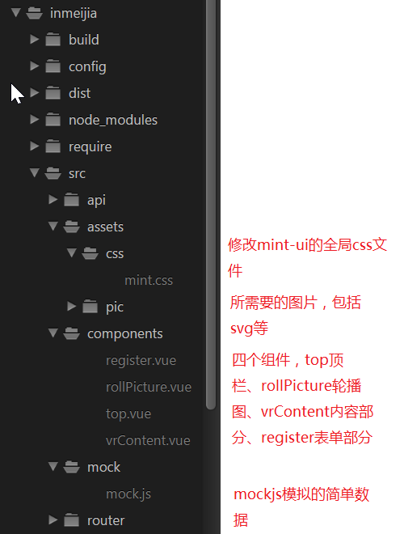
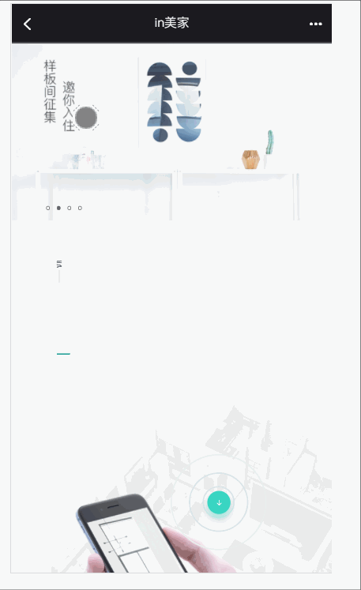

### 项目介绍

	目录结构

	启动步骤
1. git clone  https://github.com/wuyudianye/inmeijia-project.git
2. 进入项目文件夹 cd inmeijia-project
3. 安装依赖 	npm install
4. 进入开发模式 npm run dev  本项目运行在8899端口。

排期计划请见 plan.md

### 附加部分

1. 移动端采用rem，以设计稿上100px为1rem为标准。
2. 用backgrounds-image防止svg，可以更方便伸缩。
3. 比如提交表单，若表单填写不达标准，则为disabled状态；绿色图标做成电波动画效果。

### 问题与解决
1. 用mock.js简单模拟数据。
2. 所给的内容图片（有手有手机的图片）上有一小条白条，暂未处理。
3. top组件（顶部）的icon更改。
4. 轮播图组件可以改为用axios从后台得到图片地址。
5. 制作表单组件时，首先是试图重写select,但是在chrome浏览器中，select 的option宽度无法做到与select相同，以失败告终；随后用mint-ui的field和pupup和picker组件制作。

### GIF演示

